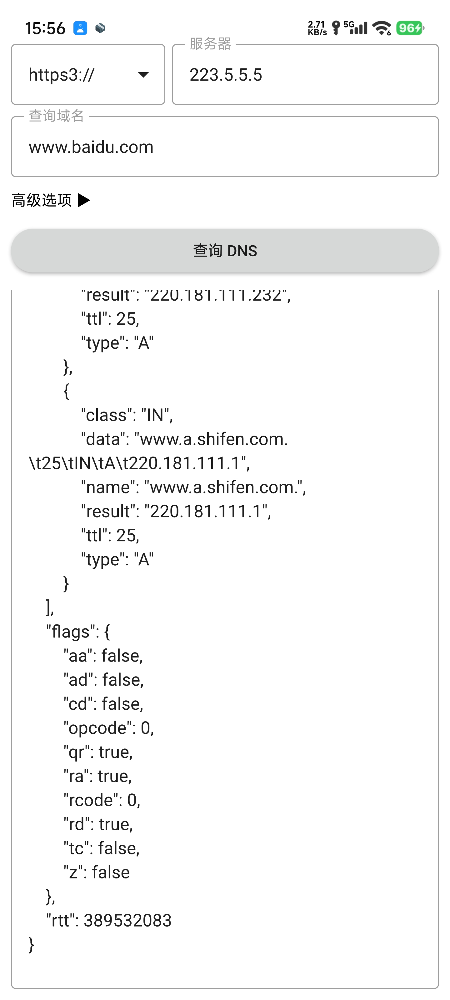

# NetTest.Go

NetTest.Go 是一个用于网络测试的工具，旨在帮助开发人员和测试人员快速验证网络服务的可用性和性能。

目前支持 DNS 查询，包括 UDP, TCP, DoT 和 DoH 等协议，同时支持通过 socks5 代理进行测试。

跨平台支持，包括 Windows, Linux, MacOS, Android 等平台。

<!-- 
 -->

## TODO

- [x] DoQ, DoH3 等协议支持
- [ ] 添加 TCP/UDP 的客户端和服务端支持
- [ ] 添加 WebSocket, gRPC 等高级功能支持
- [ ] 支持通过 socks5 代理进行测试
